# OML Terminal

**The network and security engineer's cockpit for Windows.** SSH, Telnet, serial, RDP, VNC and SFTP in tabs and split
views, plus a toolkit built for people who run networks: a visual traceroute that tells you where the problem really
is, WireWalk hop-by-hop device paths, continuous multi-host ping, MRTG-style SNMP traffic graphs, a packet analyzer, a Wi-Fi
analyzer with site-survey heatmaps, topology discovery, config backups with change detection, and firewall
policy tooling for eight vendors.

**Free for the community.** OML has paid subscriptions; OML Terminal is free and open source as a thank-you to the
network community. No telemetry, no account, no lock-in.

[**Download for Windows**](https://omllabs.com/downloads.html) · [Product page](https://omllabs.com/terminal.html) ·
License: [GPL-3.0-or-later](LICENSE)

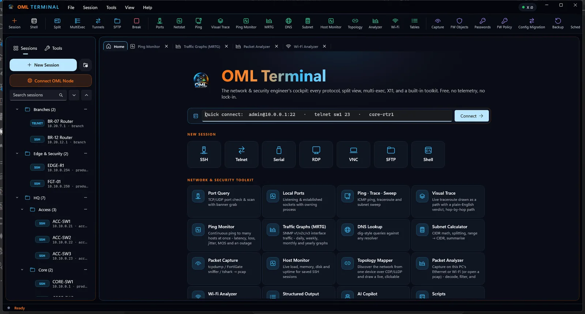

---

## Contents

- [Install](#install)
- [Sessions and terminals](#sessions-and-terminals)
- [Visual Trace](#visual-trace) - traceroute, WireWalk device path, multicast
- [Ping Monitor](#ping-monitor)
- [Traffic Graphs (MRTG)](#traffic-graphs-mrtg)
- [Packet Analyzer](#packet-analyzer)
- [Wi-Fi Analyzer](#wi-fi-analyzer)
- [Topology, backups and change control](#topology-backups-and-change-control)
- [Firewall tooling](#firewall-tooling)
- [Everyday tools](#everyday-tools)
- [Where your data lives](#where-your-data-lives)
- [Building from source](#building-from-source)
- [License](#license)

---

## Install

1. Download `OML-Terminal-Setup-<version>.exe` from [omllabs.com/downloads](https://omllabs.com/downloads.html).
2. Run it. The installer is self-contained (the .NET runtime and Windows App SDK are included) and installs per user,
   so it doesn't need admin rights.

**Requirements:** Windows 10 version 1809 or later, or Windows 11, on x64.

**Optional:**

- [Npcap](https://npcap.com) for packet capture on Ethernet and Wi-Fi. Without it, the Packet Analyzer falls back to a
  raw socket, which needs admin rights and sees IP traffic only.
- **Location** permission on Windows 11, for Wi-Fi scanning. Windows treats nearby network names as location data.

---

## Sessions and terminals

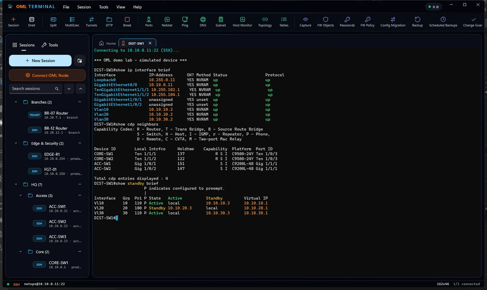

- **Protocols:** SSH, Telnet, serial console, RDP, VNC, SFTP and local shells (PowerShell, cmd, WSL), all in tabs.
- **Split view and MultiExec:** split view shows several sessions side by side, and MultiExec types into many devices at once.
- **SSH:**
  - jump hosts, local, remote and dynamic (SOCKS) tunnels, and X11 forwarding (a built-in X server)
  - host keys are checked trust-on-first-use, with a clear warning if a key changes
- **Saved sessions:**
  - stored in folders and found with instant search
  - imports from PuTTY, MobaXterm, SecureCRT and CSV
- **Password Manager:** sessions and backups share saved logins and enable passwords, which are encrypted at rest.
- **Quick connect:** type `admin@10.0.0.1:22`, `telnet sw1 23` or a saved session's name.
- **Macros and Scripts:** run your own PowerShell, Python or Bash scripts with session context.
- **AI Copilot (optional):** a local-LLM assistant with its own connection to a device. It asks before running anything risky.
- **Voice input:** dictate CLI commands. They're matched against vendor grammars and checked before they're typed.

---

## Visual Trace

A traceroute that draws the path and tells you, in plain English, where the problem really is. It has three modes.

### From this PC: a live, continuous traceroute

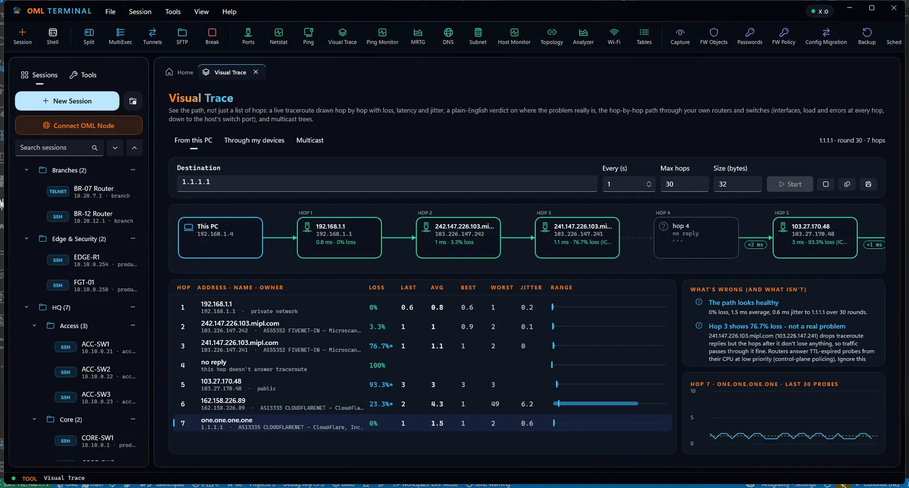

- **Continuous probing:** every hop is probed every round (MTR-style), building up loss, last, average, best, worst
  and jitter. Hop latency comes from Windows' own ICMP timing, so it matches `tracert`.
- **Separates real problems from noise:**
  - Loss at a router that the hops after it don't see is ICMP rate limiting, so it's reported as harmless.
  - Loss that starts at a hop and carries on to the destination is real, and the hop is named.
- **Other findings:** latency jumps (distance vs. congestion), silent hops, routing loops, route changes,
  load-balanced hops, "destination unreachable / administratively prohibited" replies, and where traffic leaves your network.
- **Who owns each hop:**
  - your own device and interface, from your config backups or saved sessions
  - a private or carrier-NAT range
  - for public addresses, the AS number and owner (via Team Cymru's DNS lookup)
- **Call quality:** a MOS estimate (ITU-T E-model) for voice and video.
- **Timeline:** a latency graph for any hop, with lost probes marked in red.
- **Export:** copy a text report for a ticket, or save the hop statistics as CSV.

### WireWalk: follow the packet, device by device

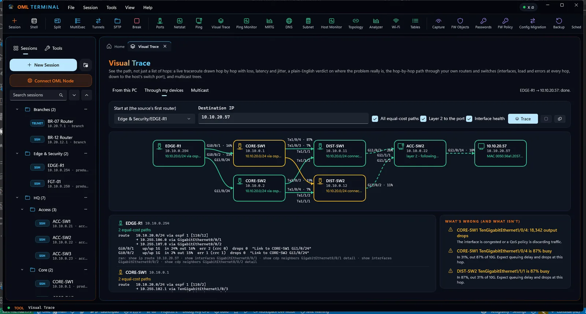

WireWalk (the **Through my devices** mode) starts from a saved SSH session and traces the path through your own network the way you would by hand.
It only runs read-only `show` commands.

1. **Route lookup:** it looks up the route to the destination on each router (`show ip route <ip>`, the full table, NX-OS or Junos formats).
2. **Next device:** it finds who's on the other end of the egress interface. It tries CDP/LLDP on that port first,
   then a saved session or config backup that owns the next-hop address, then SSH to the next hop itself.
3. **Equal-cost paths:** every equal-cost branch is followed, several devices at a time.
4. **Interface health:** each interface on the path is read for status, load (% of link speed), input errors,
   CRC errors and output drops.
5. **Last mile:** at the last router it resolves ARP, then walks MAC address tables switch by switch down to the host's access port.

It reports no-route drops, down interfaces, links over 80% busy, error and drop counters, devices it couldn't log in
to, and silent hosts. Every command it ran is listed under each device.

### Multicast: RPF walk and mtrace

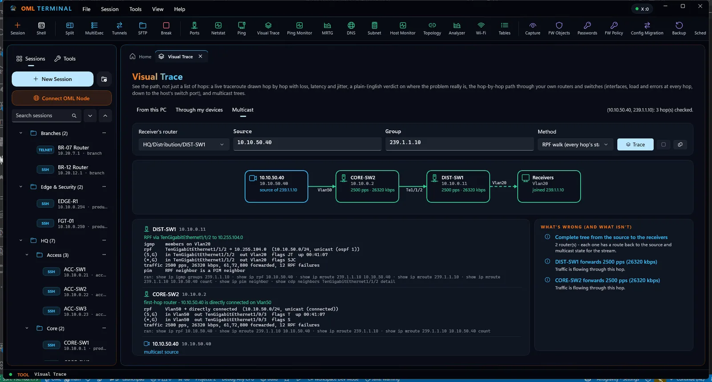

- **RPF walk:** starting at the router nearest the receivers, it walks back toward the source. On each router it checks:
  - `show ip rpf`
  - the (S,G) and (*,G) state
  - forwarding counters and RPF failures
  - the PIM neighbor toward the source
  - IGMP members of the group

  It names the exact hop where the RPF check fails, the state is missing or pruned, or PIM is down.
- **Router mtrace:** runs the router's own `mtrace` and draws the result. Cisco IOS and IOS-XE only.

---

## Ping Monitor

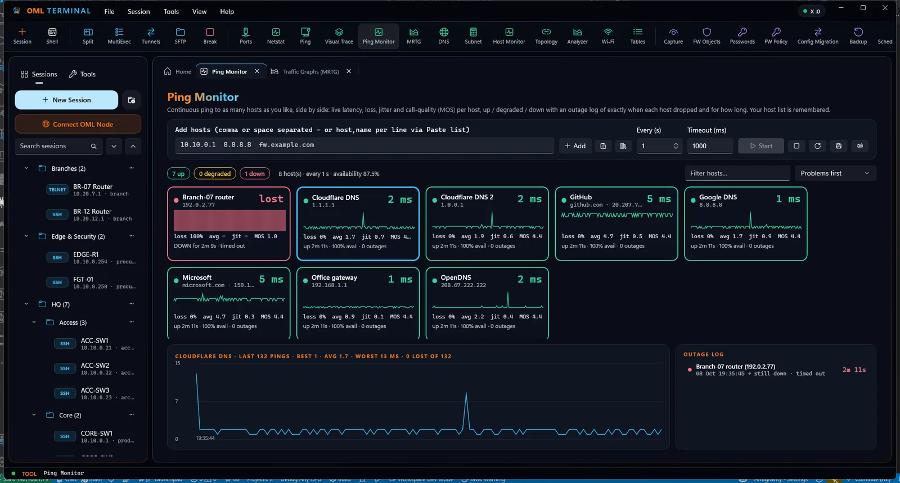

Continuous ping to as many hosts as you like, each on its own schedule.

- **Live tiles:** each host shows its current latency and a sparkline, with loss, average and jitter over the last
  minute, a call-quality (MOS) score, availability and an outage count.
- **States:** up, degraded (loss or latency over your threshold) and down (lost replies in a row). Click a tile to graph up to an hour of history.
- **Outage log:** exactly when each host dropped, why (timed out, host or network unreachable, name not resolving),
  and how long it was down.
- **Host lists:** paste a list (`host,name,group` per line works straight from Excel) or add every saved session in one click.
  The list is remembered.
- **Alerts and export:** optional beep when a host goes down, and CSV export of statistics and outages.

---

## Traffic Graphs (MRTG)

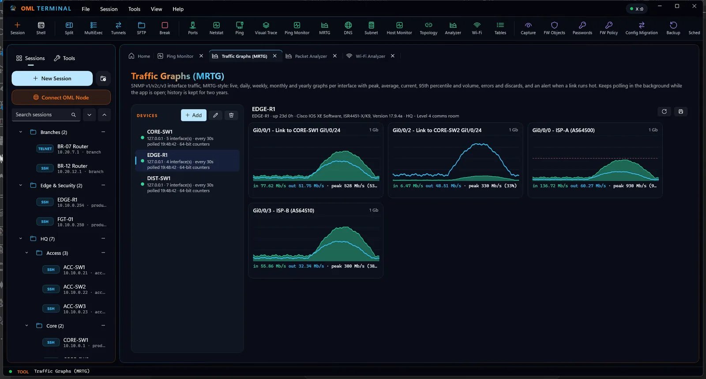

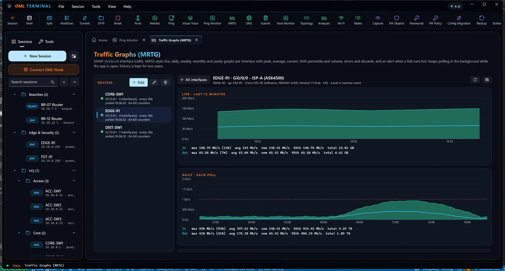

- **SNMP versions:**
  - SNMP **v1, v2c and v3**
  - v3 authentication: MD5, SHA-1 and SHA-224/256/384/512
  - v3 privacy: DES and AES-128/192/256, in both the net-snmp and the Cisco key-extension variants
- **Discovery:** interfaces are listed from IF-MIB (name, alias, speed, status), with up physical ports pre-selected.
  64-bit counters are used when the agent has them, and counter wraps and agent reboots are handled.
- **Graphs:** the classic MRTG set per interface: live (15 min), daily, weekly, monthly and yearly. Inbound is an
  area and outbound a line, with the link speed marked.
- **Statistics:** max, average, current, **95th percentile** and total volume, plus errors and discards.
- **Polling:** in the background while the app is open, whether or not the tab is open.
  History is consolidated (every poll for 2 days, then 30-minute, 2-hour and daily averages with peaks) and kept for two years.
- **Alerts and export:** an alert when a link runs over your threshold, and CSV export.

---

## Packet Analyzer

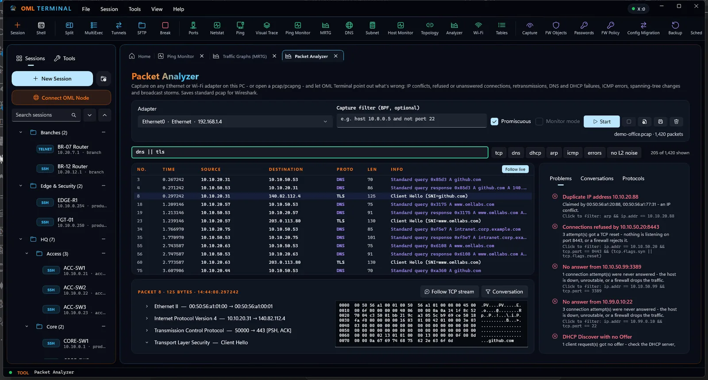

- **Capture:** on any Ethernet or Wi-Fi adapter with Npcap (promiscuous mode, BPF capture filters, monitor mode on
  supported Wi-Fi adapters), or open a `.pcap` or `.pcapng`. Captures save as standard pcap for Wireshark.
- **Decoding:**
  - Ethernet, 802.1Q, ARP, IPv4/IPv6 and ICMP
  - TCP and UDP
  - DNS, mDNS and LLMNR
  - DHCP, TLS (SNI), HTTP, SSH, NTP, Syslog, TFTP, BGP, OSPF and HSRP
  - STP, PVST+, CDP, LLDP, DTP and UDLD
  - 802.11 (radiotap) and more
- **Display filters:** Wireshark-style, e.g. `ip.addr == 10.0.0.0/24 && tcp.port == 443`, `dns.qry.name contains "corp"` or `!arp`.
- **Problems panel:** it points out problems, and clicking one filters to the packets involved. It finds:
  - duplicate IP addresses
  - refused or unanswered connections
  - retransmissions and zero windows
  - DNS errors and slow or unanswered queries
  - DHCP with no offer, or NAK
  - ICMP unreachables
  - spanning-tree topology changes
  - broadcast storms
- **Also:** Follow TCP stream, conversations, and protocol statistics.
- **Sample capture:** try [`docs/samples/demo-office.pcap`](docs/samples/demo-office.pcap), a minute of a fictional
  office network with problems planted in it.

---

## Wi-Fi Analyzer

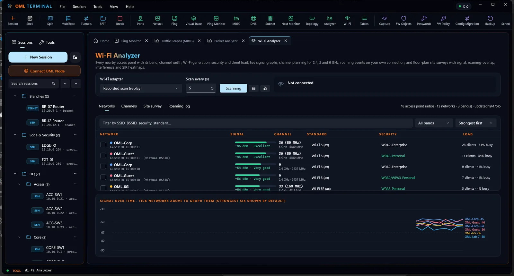

- **Networks:** every nearby access point radio, with:
  - band, channel and channel width (20 to 320 MHz)
  - Wi-Fi generation (4, 5, 6, 6E or 7)
  - security (including WPA3 and OWE)
  - client count and channel utilization
  - virtual BSSIDs
- **Signal graph:** signal over time for any networks you tick.
- **Channel planning** for 2.4, 5 and 6 GHz. It recommends the quietest channel (1/6/11, avoiding DFS unless you allow
  it, PSC channels on 6 GHz) and warns about overlapping channels, 40 MHz on 2.4 GHz, weak security and busy channels.
- **Roaming log:** roams, drops and reconnects on your own connection.
- **Saved scans:** save and reopen scans to review a site visit later, or to analyze on a PC without Wi-Fi.

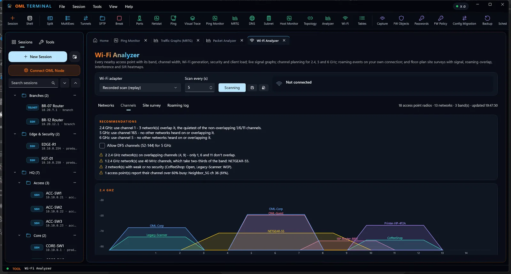

### Site survey

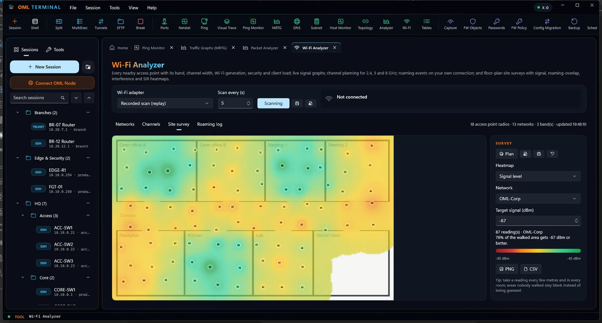

- **Taking readings:** load a floor plan, walk the site and click where you're standing.
- **Heatmaps:** signal level, roaming overlap (second-best AP), networks heard and signal-to-interference. Areas
  nobody walked stay blank instead of being guessed.
- **Coverage figure:** the share of the walked area that meets your target signal (−67 dBm by default).
- **Export:** PNG and CSV. Surveys save as one `.omlsurvey` file holding the plan and the readings.

---

## Topology, backups and change control

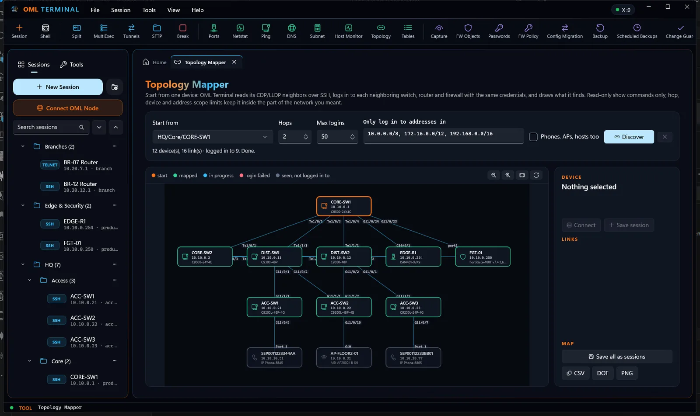

- **Topology Mapper:** discovers the network from one device over CDP/LLDP within the depth, scope and device limits
  you set. It draws a live, clickable map, and you can open a session or save every discovered device.
- **Config Backup:** pulls running configs over SSH (presets for common vendors), detects changes and shows a diff.
- **Scheduled Backups:** recurring backups with drift alerts while the app is open.
- **Change Guard:** take before and after snapshots around a change. It reports in plain English what went down,
  what rerouted and what disappeared.
- **Global Search** (Ctrl+Shift+G): find an IP, subnet, MAC or any text across every backup, log, capture and session.
- **Structured Output:** turns `show` command output into a sortable, filterable table, with CSV and Markdown export.

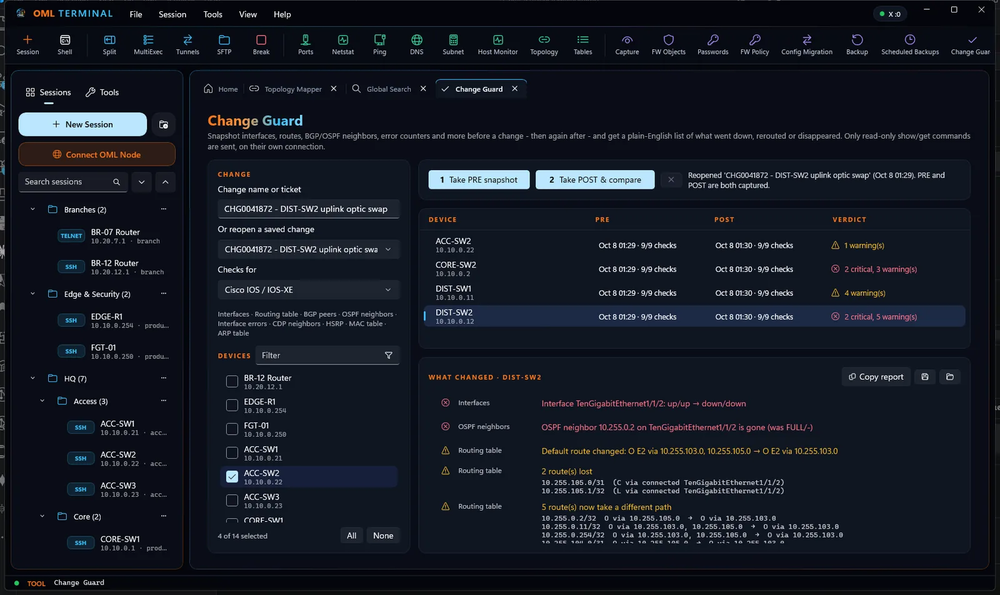

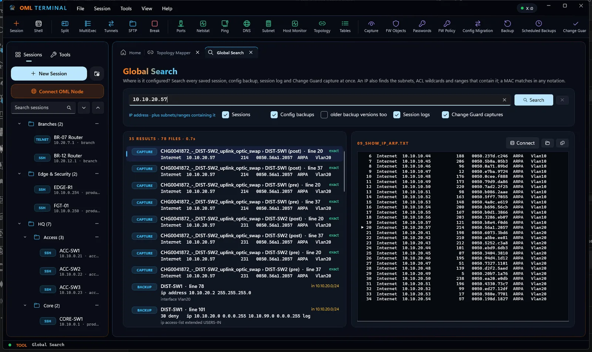

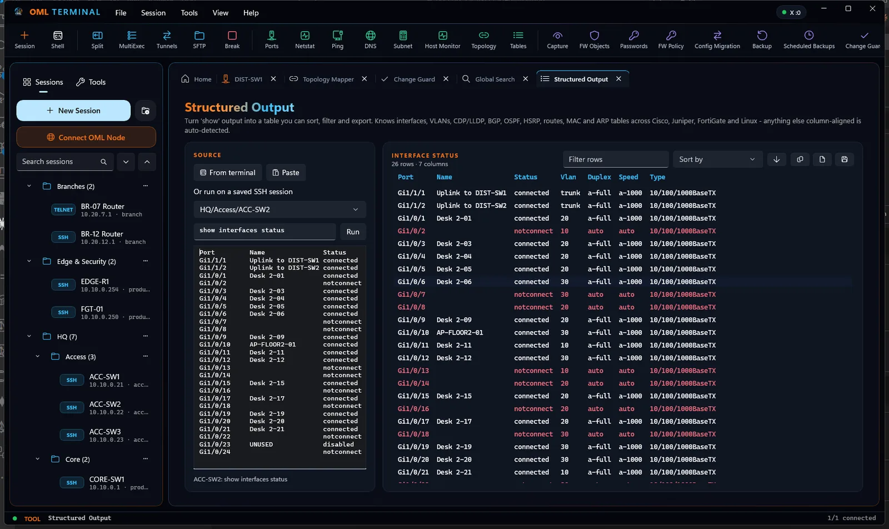

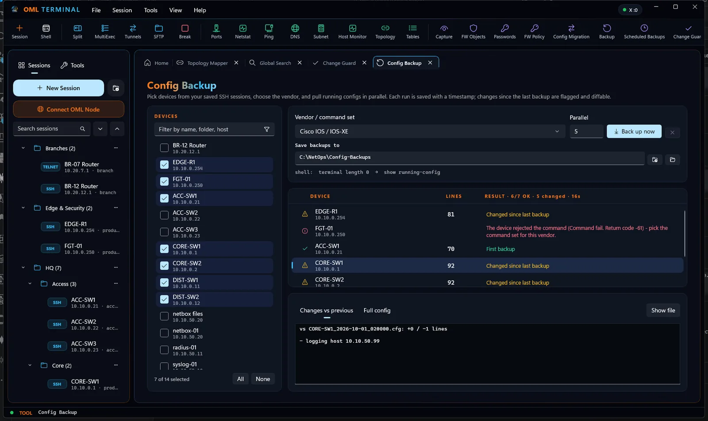

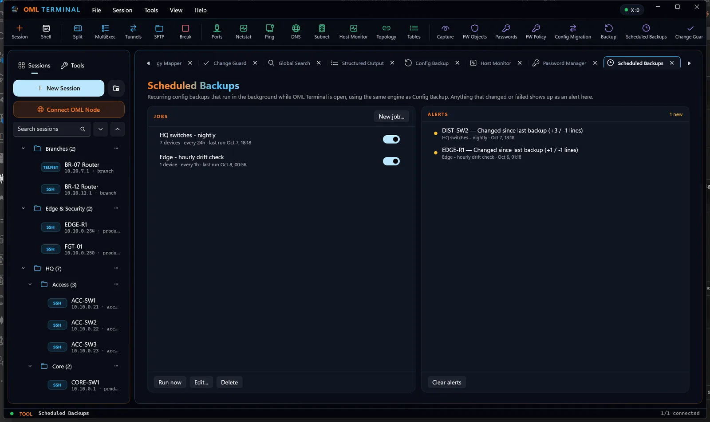

---

## Firewall tooling

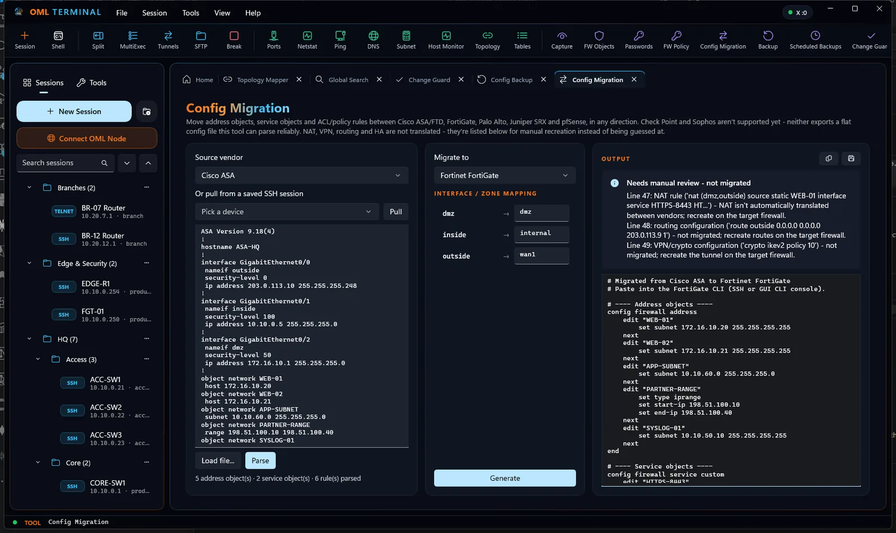

- **Config Migration:** moves objects, services and rules between Cisco ASA/FTD, FortiGate, Palo Alto, Juniper SRX
  and pfSense, with a review step.
- **Firewall Policy Builder:** turns an Excel sheet of rules into policies for 8 firewall vendors.
- **Firewall Object Builder:** bulk addresses, FQDNs and services for the same vendors.

---

## Everyday tools

- **Host Monitor:** live load, memory, disk and uptime for saved SSH sessions.
- **Ping · Trace · Sweep, Port Query** (with banner grab), **Local Ports** (sockets with their owning process) and **DNS Lookup** (dig-style).
- **Subnet Calculator:** CIDR math, splitting, ranges to CIDR, and summarisation.
- **CLI Guide:** a searchable command reference for every supported vendor.
- **Network Services:** TFTP and FTP servers and client, Syslog, SNTP and DHCP (tftpd64-style).
- **Packet Capture on devices:** tcpdump, FortiGate sniffer and tshark output to pcap.

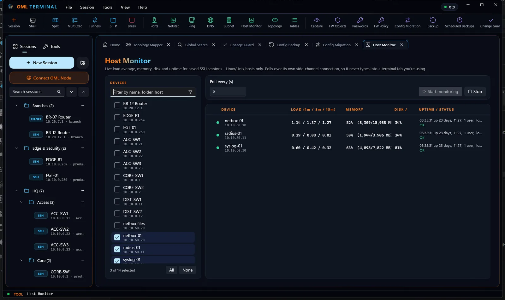

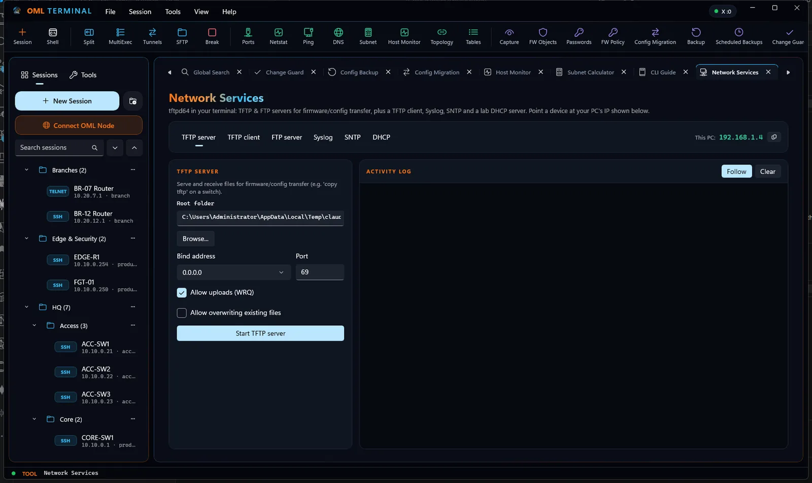

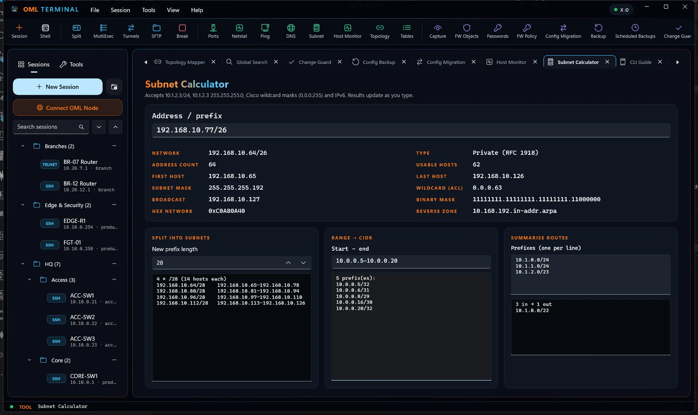


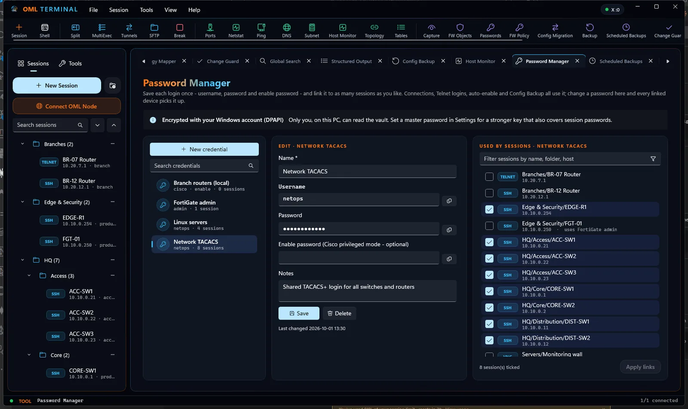

---

## Where your data lives

Everything stays on your PC, in `%USERPROFILE%\.oml-terminal`. You can set `OML_TERMINAL_HOME` to use another folder,
for a portable install or a second profile.

- **Saved data:** sessions, the password vault, backups, traffic history, the ping list and known host keys.
- **Secrets:** encrypted at rest, with AES-256-GCM when you set a master password, otherwise Windows DPAPI for your account.
- **Network use:** OML Terminal doesn't phone home. It only contacts what you point it at, plus DNS lookups for
  traceroute hop names and AS owners.

---

## Building from source

You need Windows 10 or 11 x64 with the [.NET 10 SDK](https://dotnet.microsoft.com/download) installed.

```powershell
git clone https://github.com/singhranjit/OML-TERMINAL.git
cd OML-TERMINAL
dotnet build src\OmlTerminal.App -c Release -p:Platform=x64
dotnet test  tests\OmlTerminal.Core.Tests
```

To make the self-contained build and installer (requires [Inno Setup 6](https://jrsoftware.org/isinfo.php)):

```powershell
dotnet publish src\OmlTerminal.App\OmlTerminal.App.csproj -c Release -p:Platform=x64 -r win-x64 --self-contained true -o publish\setup-staging
ISCC installer\OmlTerminal.iss
```

| Path | What's there |
| --- | --- |
| `src/OmlTerminal.App` | WinUI 3 desktop app (views, tools, terminal control) |
| `src/OmlTerminal.Core` | Everything testable: protocols, parsers, trace/SNMP/capture engines, persistence |
| `tests/OmlTerminal.Core.Tests` | xUnit tests |
| `installer` | Inno Setup script |
| `docs` | Screenshots and the sample capture |

Bug reports and pull requests are welcome.

## License

[GPL-3.0-or-later](LICENSE). © OML Labs and contributors.
